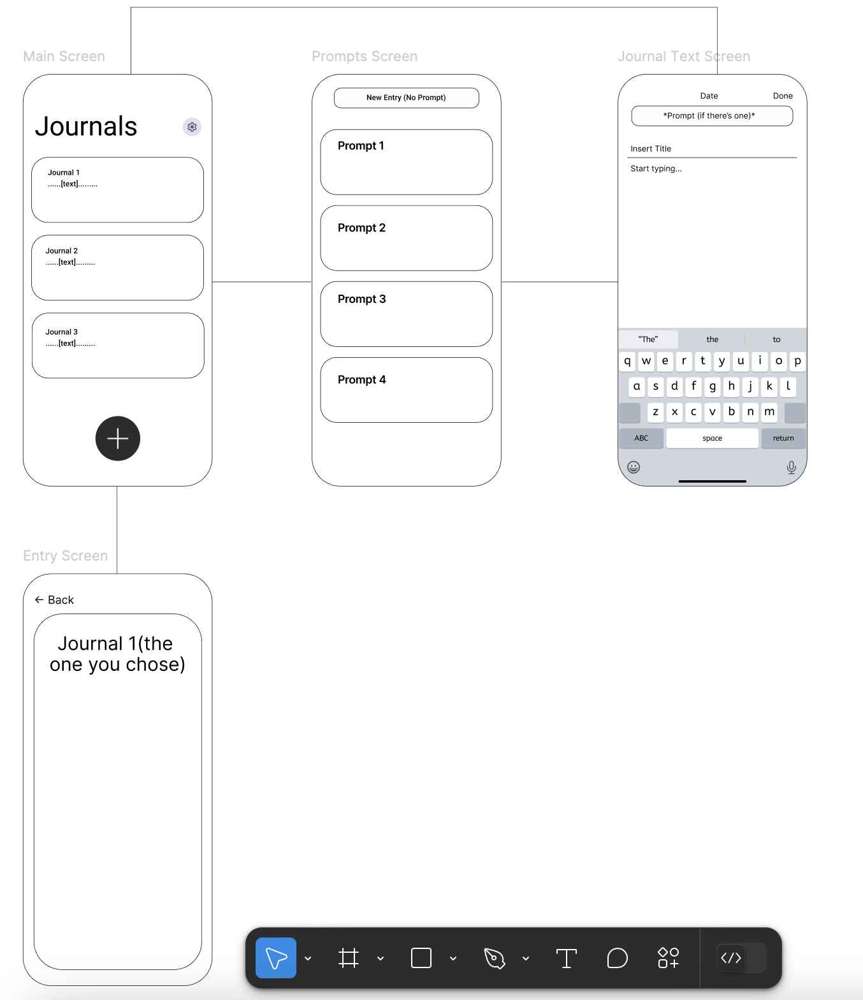
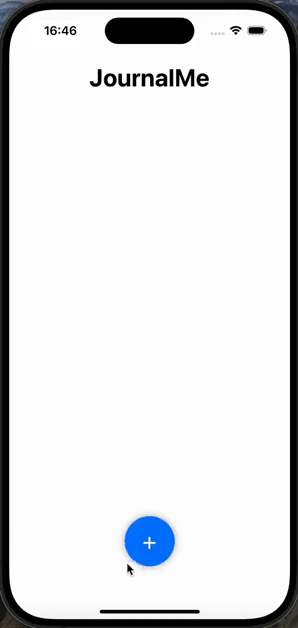

# JournalMe

## Table of Contents

1. [Overview](#Overview)
2. [Product Spec](#Product-Spec)
3. [Wireframes](#Wireframes)
4. [Gifs](#Gifs)

## Overview

### Description

JournalMe is an app that allows individuals to make a daily routine to journal anything they want to. Studies have shown that journaling can help mentally, and this app is a good way to do so, by giving prompts (or allowing for freewriting), and storing the journals securely to look back at them.

### App Evaluation

- **Category:** Lifestyle, Productivity
- **Mobile:** Mobile only
- **Story:**  Helps individuals tackle their day-to-day by writing
- **Market:** Anyone who would like to journal
- **Habit:** Intended for daily use, but can be used as needed
- **Scope:** It will be more of a broad scope to appeal to more people

## Product Spec

### 1. User Stories (Required and Optional)

**Required Must-have Stories**

- [x] User can create text entries (with or without prompts)
- [ ] User is provided AI generated prompts
- [ ] User can see their previous entries
- [ ] All entries must be saved on a database API (ie Firebase)

**Optional Nice-to-have Stories**

- [ ] User can choose to lock their entries for personal privacy
- [ ] User can attatch various forms of media when journaling
- [ ] A search bar for a user to search up specific details from entries
- [ ] User can click on the entry in the main screen to view the whole entry

### 2. Screen Archetypes

- [ ] Main Screen
* Allows user to create an entry / See previous entries
- [ ] Prompt Screen
* Allows user to choose a given prompt or create a blank entry
- [ ] Journal Text Screen
* Where user types out their entry
- [ ] Entry Screen
* A view of the selected entry

### 3. Navigation

**Tab Navigation** (Tab to Screen)
* Honestly, there is not a tab bar, only buttons, as I wanted to make the UI as 'clean' and simple as I can. I find that to be more pleasing to the eye.

**Flow Navigation** (Screen to Screen)

- [ ] **Main Screen**
  * Leads to **Prompt Screen**
  * Also Leads to **Entry Screen**
- [ ] **Prompt Screen**
  * Leads to **Journal Text Screen**
- [ ] **Journal Text Screen**
  * Leads to **Main Screen**

## Wireframes

## Gifs

### Unit 8 (Sprint 1)

    
  

